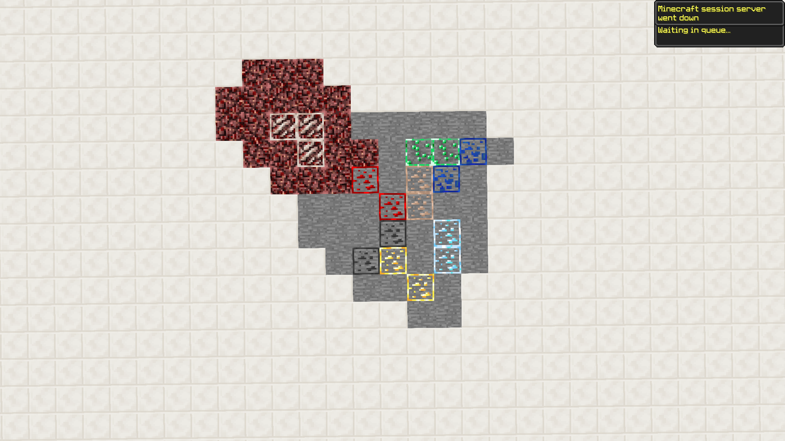
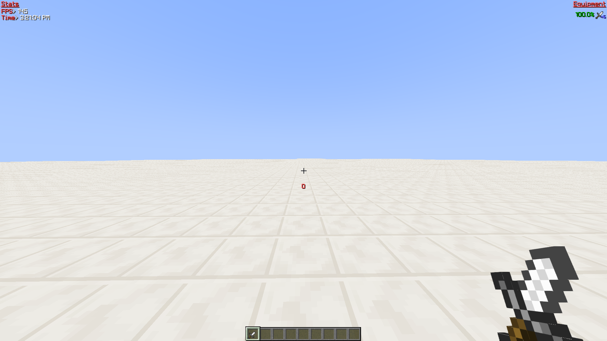
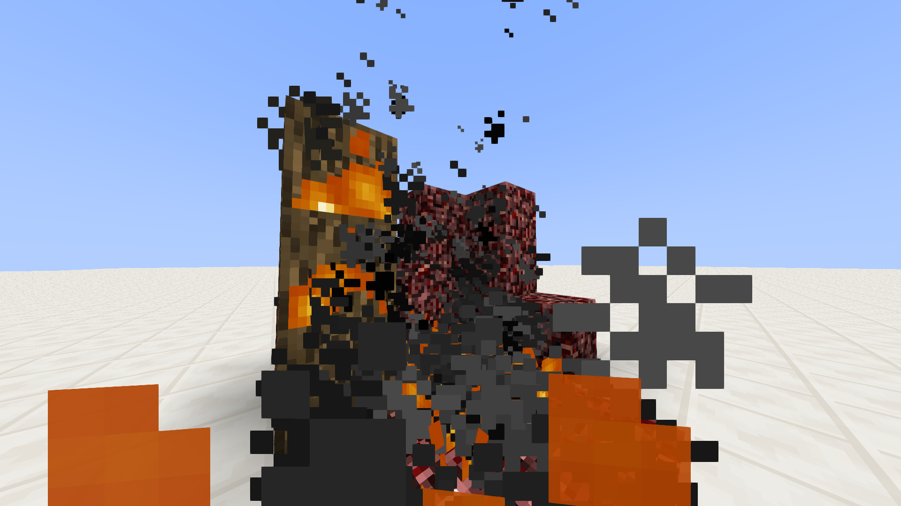
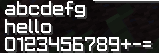
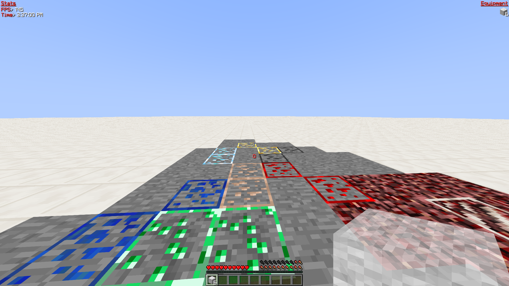
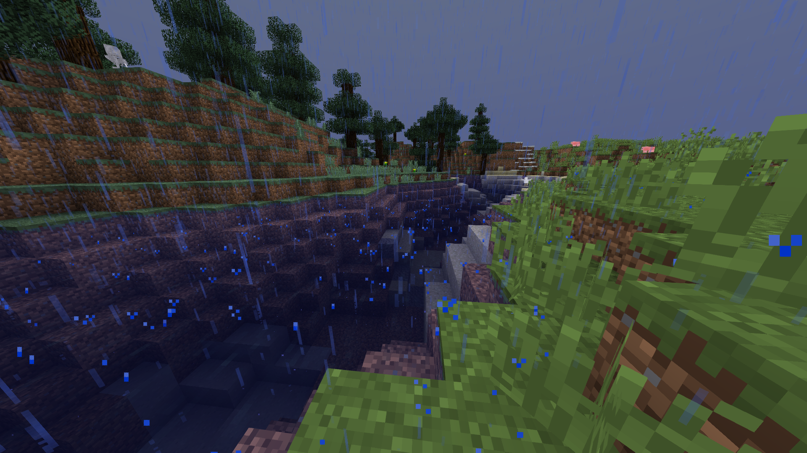
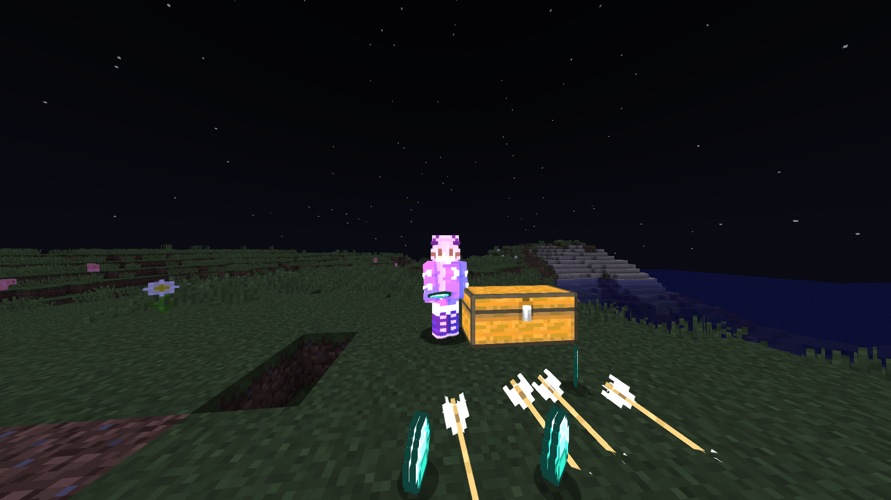

# utala
utala is a minecraft PVP resource pack and shaderpack that is designed around increasing visibility while maintaining a vanilla aesthetic

utala is currently in developement, while it is currently functional there are features and changes that I want to make.

# Resource Pack Features
### Ore Borders

### Short Swords

### Low Fire

### Font

The font is a slightly modified version of the font from [Plast](https://github.com/Plastix/Plast-Pack). However I want to make my own font for this in the future.

### Mining indicator
[github only supports gifs for preview and I hate creating gifs so heres a link to a webm of it in action](https://raw.githubusercontent.com/Id405/utala/main/images/mining.webm)
Adds a mining progress indicator to the edges of the block breaking animation

# Shader Pack Features
While most shaderpacks are focused around increasing visual quality at the cost of performance, utala's is about increasing visibility.

# Transparent Hand

# Increase water and weather transparency

# Chest, Player, Item, and Arrow Highlight

Increases the brightness of Players, Chests, Arrows, and Items to increase visibility.

# Customizability

utala's shaders have options to control what is highlighted, and the opacity of hands, weather, and water.

utala's resource pack is seperated into a base, font, and short swords to allow you to choose which features you want.
